# MagazineLayout
A collection view layout capable of laying out views in vertically scrolling grids and lists.

[](https://github.com/apple/swift-package-manager)
[](https://github.com/Carthage/Carthage)
[](https://cocoapods.org/pods/MagazineLayout)
[](https://cocoapods.org/pods/MagazineLayout)
[](https://cocoapods.org/pods/MagazineLayout)


## Introduction
`MagazineLayout` is a `UICollectionViewLayout` subclass for laying out vertically scrolling grids and lists of items. Compared to `UICollectionViewFlowLayout`, `MagazineLayout` supports many additional features:

- Item widths based on a fraction of the total available width
	- Full width for a list layout (similar to `UITableView`)
	- Half-width, third-width, etc. for a grid layout
- Self-sizing in just the vertical dimension
- Per-item self-sizing preferences (self-size and statically-size items anywhere in your collection view)
- Self-sizing headers and footers
- Hiding or showing headers and footers on a per-section basis
- Pinned (sticky) headers and footers
- Section backgrounds that can be hidden / visible on a per-section basis
- Customizable insert and delete animations for items and supplementary views

Other features:
- Specifying horizontal item spacing on a per-section basis
- Specifying vertical row spacing on a per-section basis
- Specifying section insets on a per-section basis
- Specifying item insets on a per-section basis

These capabilities have allowed us to build a wide variety of screens in the Airbnb app, many of which are among our highest-traffic screens. Here are just a few examples of screens laid out using `MagazineLayout`:

| Homes Search | Experiences Search | Wish List | Home  |
| --- | --- | --- | --- |
| 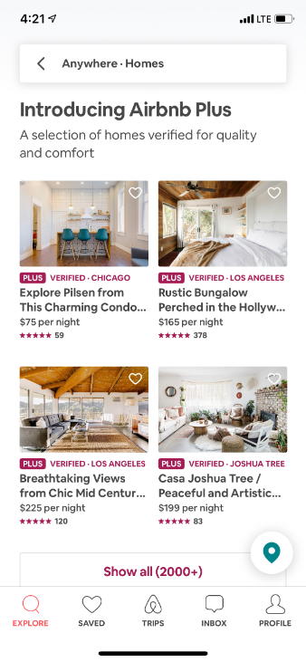 |   | 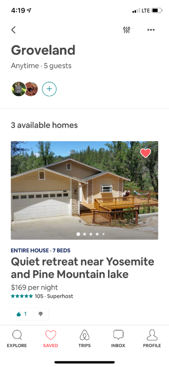 |  |

| Plus Home | Plus Home Tour | Trips | Trip Detail |
| --- | --- | --- | --- |
|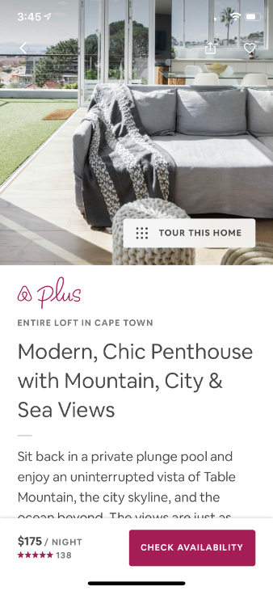 | 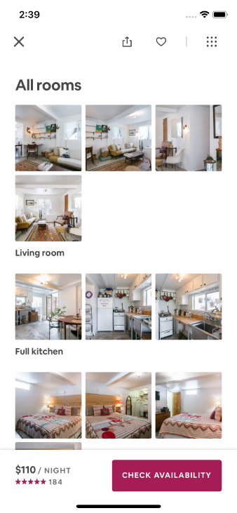 | 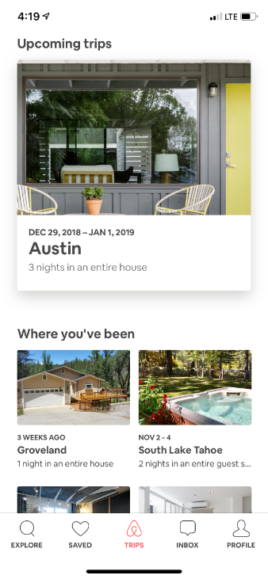 |  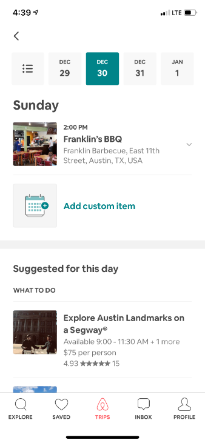 |

## Table of Contents
- [Example App](#example-app)
	- [Using the Example App](#using-the-example-app)
		- [Adding a new item](#adding-a-new-item)
		- [Deleting an item](#deleting-an-item)
- [Getting Started](#getting-started)
	- [Requirements](#requirements)
	- [Installation](#installation)
		- [Carthage](#carthage)
		- [CocoaPods](#cocoapods)
	- [Usage](#usage)
		- [Setting up cells and headers](#setting-up-cells-and-headers)
		- [Importing MagazineLayout](#importing-magazinelayout)
		- [Setting up the collection view](#setting-up-the-collection-view)
		- [Registering cells and supplementary views](#registering-cells-and-supplementary-views)
		- [Setting the data source](#setting-the-data-source)
		- [Configuring the delegate](#configuring-the-delegate)
* [Contributions](#contributions)
* [Maintainers](#maintainers)
* [Contributors](#contributors)
* [License](#license)

## Example App
An example app is available to showcase and enable you to test some of `MagazineLayout`'s features. It can be found in `./Example/MagazineLayoutExample.xcworkspace`. 

Note: Make sure to use the `.xcworkspace` file, and not the `.xcodeproj` file, as the latter does not have access to `MagazineLayout.framework`.

### Using the Example App
When you first open the example app, you'll see many items and sections pre-populated. Most items are configured to self-size based on the text they're displaying.

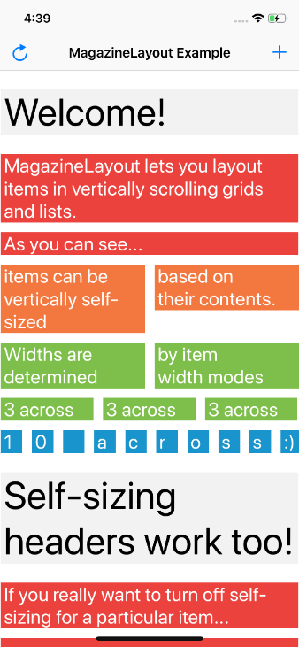

If you'd like to get rid of the sample content and start with a blank collection view, you can tap the reload icon in the navigation bar.

| Reload Menu | No Items |
| --- | --- |
| 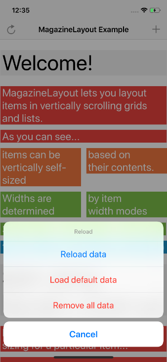 | 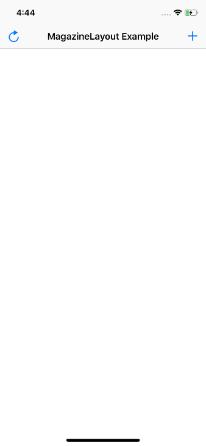 |

From this menu, you can also reset the app back to the original sample data.

#### Adding a new item
To add a new item, tap the add icon in the navigation bar.

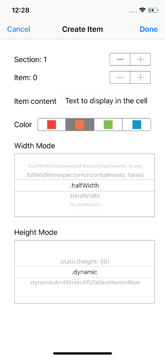

From the add screen, you can configure a new item to insert into the `UICollectionView`. The item will be inserted with an animation once you tap the done button in the navigation bar.

Item configuration options:

- Section index (will create a new section if one does not exist for the specified index)
- Item index (position in the specified section)
- Item content / text to be displayed in the item (this will change how tall the item is if using a `.dynamic` height mode)
- Color to use for the background of the item
- Width mode (controls how wide the item should be in relation to the available width)
- Height mode (controls self-sizing behavior)

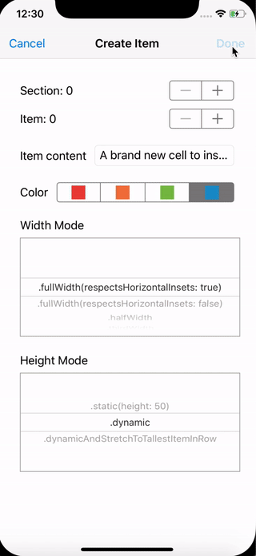

#### Deleting an item
To delete an item, simple tap on the item in the collection view. The item will be deleted with an animation.

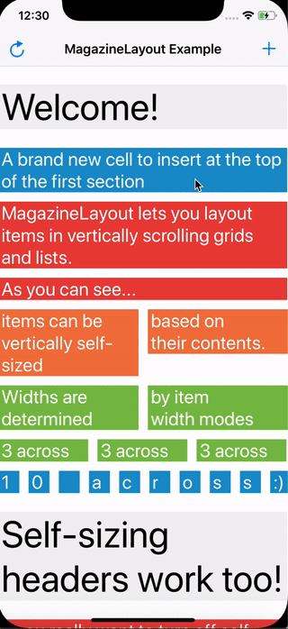

## Getting Started

### Requirements
- Deployment target iOS 10.0+, tvOS 10.0+
- Swift 4+
- Xcode 10+

### Installation
#### Carthage
To install `MagazineLayout` using [Carthage](https://github.com/Carthage/Carthage), add
`github "airbnb/MagazineLayout"` to your Cartfile, then follow the integration tutorial [here](https://github.com/Carthage/Carthage#if-youre-building-for-ios-tvos-or-watchos).

#### CocoaPods
To install `MagazineLayout` using [CocoaPods](http://cocoapods.org), add
`pod 'MagazineLayout'` to your Podfile, then follow the integration tutorial [here](https://guides.cocoapods.org/using/using-cocoapods.html).


### Usage
Once you've integrated the `MagazineLayout` into your project, using it with a collection view is easy.

#### Setting up cells and headers
[Due to shortcomings in `UIKit`](MagazineLayout/Public/Views/MagazineLayoutCollectionViewCell.swift#L34-L39), `MagazineLayout` requires its own `UICollectionViewCell` and `UICollectionReusableView` subclasses:
-  `MagazineLayoutCollectionViewCell`
- `MagazineLayoutCollectionReusableView`

These two types enable cells and supplementary views to self-size correctly when using `MagazineLayout`. **Make sure that the custom cell and reusable view types in your app subclass from `MagazineLayoutCollectionViewCell` and `MagazineLayoutCollectionReusableView`, respectively.** 

Alternatively, you can copy the implementation of `preferredLayoutAttributesFitting(_:)`
for use in your custom cell and reusable view types, without subclassing from the ones `MagazineLayout` provides.

#### Importing MagazineLayout
At the top of the file where you'd like to use `MagazineLayout` (likely a `UIView` or `UIViewController` subclass), import `MagazineLayout`.
```swift
import MagazineLayout 
```

#### Setting up the collection view
Create your `UICollectionView` instance, passing in a `MagazineLayout` instance for the layout parameter.
```swift
let layout = MagazineLayout()
let collectionView = UICollectionView(frame: .zero, collectionViewLayout: layout)

```

Make sure to add  `collectionView` as a subview, then properly constrain it using Auto Layout or manually set its `frame` property.

```swift
view.addSubview(collectionView)

collectionView.translatesAutoresizingMaskIntoConstraints = false

NSLayoutConstraint.activate([
  collectionView.leadingAnchor.constraint(equalTo: view.leadingAnchor),
  collectionView.trailingAnchor.constraint(equalTo: view.trailingAnchor),
  collectionView.topAnchor.constraint(equalTo: view.topAnchor),
  collectionView.bottomAnchor.constraint(equalTo: view.bottomAnchor),
])
```

#### Registering cells and supplementary views
Register your cell and reusable view types with your collection view.
```swift
collectionView.register(MyCustomCell.self, forCellWithReuseIdentifier: "MyCustomCellReuseIdentifier")

// Only necessary if you want section headers
collectionView.register(MyCustomHeader.self, forSupplementaryViewOfKind: MagazineLayout.SupplementaryViewKind.sectionHeader, withReuseIdentifier: "MyCustomHeaderReuseIdentifier")

// Only necessary if you want section footers
collectionView.register(MyCustomFooter.self, forSupplementaryViewOfKind: MagazineLayout.SupplementaryViewKind.sectionFooter, withReuseIdentifier: "MyCustomFooterReuseIdentifier")

// Only necessary if you want section backgrounds
collectionView.register(MyCustomBackground.self, forSupplementaryViewOfKind: MagazineLayout.SupplementaryViewKind.sectionBackground, withReuseIdentifier: "MyCustomBackgroundReuseIdentifier")
```

Because cells, headers, and footers can self-size (backgrounds do not self-size), in this example, `MyCustomCell`, `MyCustomHeader`, and `MyCustomFooter` **must** have the correct implementation of `preferredLayoutAttributesFitting(_:)`. See [Setting up cells and headers](#setting-up-cells-and-headers).

#### Setting the data source
Now that you've registered your view types with your collection view, it's time to wire up the data source. Like with any collection view integration, your data source needs to conform to `UICollectionViewDataSource`. If the same object that owns your collection view is also your data source, you can simply do this:
```swift
collectionView.dataSource = self
```

#### Configuring the delegate
Lastly, it's time to configure the layout to suit your needs. Like with `UICollectionViewFlowLayout` and `UICollectionViewDelegateFlowLayout`, `MagazineLayout` configured its layout through its `UICollectionViewDelegateMagazineLayout`. 

To start configuring `MagazineLayout`, set your collection view's `delegate` property to an object conforming to `UICollectionViewDelegateMagazineLayout`. If the same object that owns your collection view is also your delegate, you can simply do this:
```swift
collectionView.delegate = self
```

Here's an example delegate implementation:

```swift
extension ViewController: UICollectionViewDelegateMagazineLayout {

  func collectionView(_ collectionView: UICollectionView, layout collectionViewLayout: UICollectionViewLayout, sizeModeForItemAt indexPath: IndexPath) -> MagazineLayoutItemSizeMode {
    let widthMode = MagazineLayoutItemWidthMode.halfWidth
    let heightMode = MagazineLayoutItemHeightMode.dynamic
    return MagazineLayoutItemSizeMode(widthMode: widthMode, heightMode: heightMode)
  }

  func collectionView(_ collectionView: UICollectionView, layout collectionViewLayout: UICollectionViewLayout, visibilityModeForHeaderInSectionAtIndex index: Int) -> MagazineLayoutSupplementaryViewVisibilityMode {
    return .visible(heightMode: .dynamic, pinToVisibleBounds: true)
  }

  func collectionView(_ collectionView: UICollectionView, layout collectionViewLayout: UICollectionViewLayout, visibilityModeForFooterInSectionAtIndex index: Int) -> MagazineLayoutSupplementaryViewVisibilityMode {
    return .visible(heightMode: .dynamic, pinToVisibleBounds: false)
  }

  func collectionView(_ collectionView: UICollectionView, layout collectionViewLayout: UICollectionViewLayout, visibilityModeForBackgroundInSectionAtIndex index: Int) -> MagazineLayoutBackgroundVisibilityMode {
    return .hidden
  }

  func collectionView(_ collectionView: UICollectionView, layout collectionViewLayout: UICollectionViewLayout, horizontalSpacingForItemsInSectionAtIndex index: Int) -> CGFloat {
    return  12
  }

  func collectionView(_ collectionView: UICollectionView, layout collectionViewLayout: UICollectionViewLayout, verticalSpacingForElementsInSectionAtIndex index: Int) -> CGFloat {
    return  12
  }
  
  func collectionView(_ collectionView: UICollectionView, layout collectionViewLayout: UICollectionViewLayout, insetsForSectionAtIndex index: Int) -> UIEdgeInsets {
    return UIEdgeInsets(top: 0, left: 8, bottom: 24, right: 8)
  }

  func collectionView(_ collectionView: UICollectionView, layout collectionViewLayout: UICollectionViewLayout, insetsForItemsInSectionAtIndex index: Int) -> UIEdgeInsets {
    return UIEdgeInsets(top: 24, left: 0, bottom: 24, right: 0)
  }
  
}
```

If you've followed the steps above, you should have a working `UICollectionView` using `MagazineLayout`! If you'd like to work with a pre-made example, check out the included example project, and [the instructions for using it](#example-app).


## Contributions
`MagazineLayout` welcomes both fixes, improvements, and feature additions. If you'd like to contribute, open a pull request with a detailed description of your changes. 

As a rule of thumb, if you're proposing an API breaking change or a change to existing functionality, consider proposing it by opening an issue, rather than a pull request; we'll use the issue as a public forum for discussing whether the proposal makes sense or not.

## Maintainers
Bryan Keller
- https://github.com/bryankeller
- https://twitter.com/BKyourway19

Bryn Bodayle
- https://github.com/brynbodayle
- https://twitter.com/brynbodayle

If you or your company has found `MagazineLayout` to be useful, let us know!

## Contributors
`MagazineLayout` would not have been possible without the contributions and support from several of my colleagues at Airbnb. Bryn Bodayle, in particular, has reviewed every PR since `MagazineLayout`'s inception, as well as helped talk through and solve countless tricky `UICollectionView` and `UIKit` issues.

I'd also like to thank the following people, who have all helped pave the way for `MagazineLayout` to be successful:
- Laura Skelton
- Eric Horacek
- Tyler Hedrick
- Michael Bachand
- Xiao Pan
- Yong Li
- Luke Hiesterman
- Jordan Harband

## License

`MagazineLayout` is released under the Apache License 2.0. See [LICENSE](LICENSE) for details.
